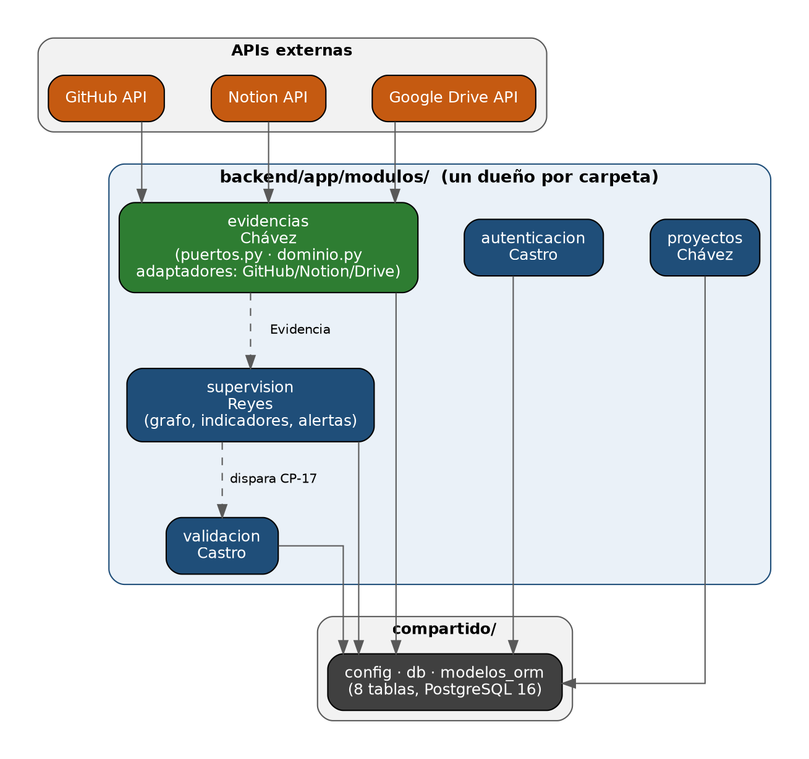

# DO-001 — Documento de arquitectura

**Proyecto:** Agentes inteligentes para el seguimiento y supervisión de proyectos de software en entornos académicos
**Equipo:** Grupo 12 — Chávez (PM), Reyes (Scrum Master), Mondragón, Castro
**Versión:** alineado al Product Backlog v6.0

## 1. Decisión: monolito modular, un módulo por dueño

Un solo despliegue (FastAPI + PostgreSQL 16), organizado por dentro en 5 módulos con arquitectura hexagonal (puertos y adaptadores). Cada módulo tiene un único dueño, y cada uno expone un contrato (`dominio.py` + `puertos.py`) para que los demás programen contra él sin esperar a que esté terminado.

Con 4 personas y 15 semanas, microservicios añadiría infraestructura que el equipo no va a alcanzar a sostener. El monolito modular da la misma separación de responsabilidades sin ese costo — y, al ser un módulo por integrante, cada quien trabaja en su propia carpeta sin pisar la de otro.

## 2. Los 5 módulos



| Módulo | Dueño | Responsabilidad |
|---|---|---|
| `autenticacion` | Castro | Login del docente, sesión, seguridad |
| `proyectos` | Chávez | Alta y gestión de proyectos supervisados |
| `evidencias` | Chávez | Agentes GitHub, Notion y Drive; normalización al esquema común |
| `supervision` | Reyes | Grafo de agentes, cálculo de indicadores I1–I4, reglas de alerta R1–R4 |
| `validacion` | Castro | Ejecución de pruebas E2E (CP-17, Playwright) en CI |

`compartido/` no es un módulo con dueño único: ahí vive lo que todos necesitan — la configuración (`config.py`), la conexión a la base (`db.py`) y las 8 tablas de PostgreSQL (`modelos_orm.py`, de TA-004).

## 3. El contrato de un módulo

Cada módulo publica, antes de que nadie dependa de él, tres archivos (esto es justamente lo que pide cada tarea AR-0X del backlog):

- **`dominio.py`** — las entidades del módulo, como clases simples (dataclasses). Sin SQLAlchemy, sin FastAPI, sin clientes HTTP: es el lenguaje que todos los demás módulos entienden.
- **`puertos.py`** — la interfaz (`Protocol`) que deben cumplir los adaptadores del módulo.
- **Un adaptador falso** — una implementación de ese puerto con datos de ejemplo, para que otro módulo programe contra él sin esperar a que el real esté listo.

Ejemplo ya construido — módulo `evidencias`:

```
backend/app/modulos/evidencias/
├── dominio.py                      # Evidencia (6 campos)
├── puertos.py                      # FuenteEvidencia
├── adaptadores/
│   ├── falso.py                    # FuenteEvidenciaFalsa (AR-01)
│   └── github/
│       ├── cliente.py              # EN-001: cliente HTTP de la API de GitHub
│       └── adaptador.py            # TA-006: FuenteEvidenciaGitHub (implementación real)
└── agentes/
    └── agente_github.py            # TA-006: nodo de LangGraph que orquesta el adaptador
```

Cuando se agreguen Notion y Drive, van junto a `github/`: `adaptadores/notion/`, `adaptadores/drive/`, cada uno con su propio `cliente.py` y `adaptador.py`, implementando el mismo `FuenteEvidencia`.

## 4. Regla de dependencia

Un módulo puede importar `compartido/`. Un módulo **no** puede importar directamente los archivos internos de otro módulo (por ejemplo, `supervision` no importa `evidencias/adaptadores/github/cliente.py`) — solo su `puertos.py` y su `dominio.py`, que son el contrato público. Esto es lo que permite que Reyes programe el grafo de supervisión contra `FuenteEvidenciaFalsa` sin tocar una línea del adaptador real de GitHub.

## 5. Arquitectura de agentes: grafo (LangGraph)

Se mantiene la decisión ya evaluada por Reyes en SP-001: el Agente Supervisor se construye como un grafo de LangGraph, no como una cadena, un árbol, un blackboard ni un enjambre — porque necesita paralelizar la lectura de las 3 fuentes y bifurcar según las reglas R1–R4 (¿hay alerta?, ¿responde Gemini o se usa la plantilla?), con trazabilidad de cada paso en LangSmith. El primer nodo real ya construido es `agente_github` (TA-006), dentro del módulo `evidencias`; el grafo completo, con los nodos de Notion, Drive, cálculo de indicadores y reglas, lo arma el módulo `supervision`.

## 6. Decisiones registradas (SP-001 y SP-002)

- **SP-001 (Reyes):** LangGraph sobre CrewAI para orquestar los agentes, por su soporte de grafos con bifurcaciones condicionales y su integración con LangSmith para trazabilidad.
- **SP-002:** gestor de tareas Notion (ya en uso por el equipo).

## 7. Próximos pasos

- Cada dueño publica el contrato de su módulo esta semana (AR-01 a AR-06).
- `evidencias` ya tiene su contrato y su primer adaptador real (GitHub, TA-006); Notion y Drive siguen el mismo patrón.
- Una vez publicados los 5 contratos, `supervision` conecta el grafo completo.
