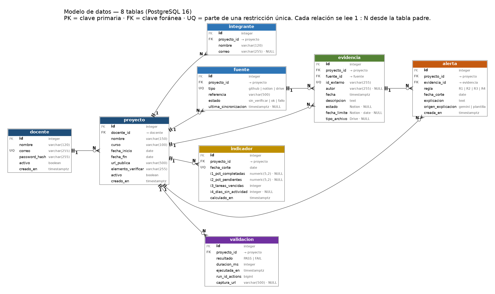
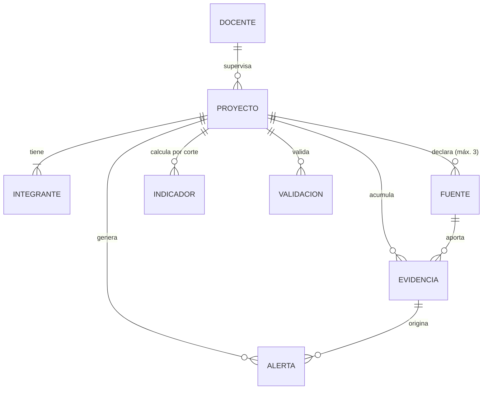

# Modelo de datos (TA-004)

Base de datos: PostgreSQL 16. Migración: `backend/alembic/versions/0001_modelo_de_datos_inicial_8_tablas.py`. Modelos: `backend/app/models.py`.



Versión vectorial: [diagrama-er.svg](diagrama-er.svg). El mismo diagrama en Mermaid (GitHub lo dibuja solo):



## Cardinalidad de cada relación

| # | Relación (padre → hija) | Cardinalidad | Clave foránea | Regla |
| --- | --- | --- | --- | --- |
| 1 | docente → proyecto | 1 : N | `proyecto.docente_id` | Cada proyecto pertenece a un solo docente (HU-001: solo ve los suyos). |
| 2 | proyecto → integrante | 1 : N | `integrante.proyecto_id` | Al menos 1 integrante por proyecto (HU-002); lo valida la API. |
| 3 | proyecto → fuente | 1 : N (máx. 3) | `fuente.proyecto_id` | Una fuente por tipo y proyecto: `UNIQUE (proyecto_id, tipo)`. |
| 4 | proyecto → evidencia | 1 : N | `evidencia.proyecto_id` | |
| 5 | fuente → evidencia | 1 : N | `evidencia.fuente_id` | `UNIQUE (fuente_id, id_externo)`: reextraer no duplica. |
| 6 | proyecto → indicador | 1 : N | `indicador.proyecto_id` | Una fila por corte: `UNIQUE (proyecto_id, fecha_corte)`. |
| 7 | proyecto → alerta | 1 : N | `alerta.proyecto_id` | |
| 8 | evidencia → alerta | 1 : N | `alerta.evidencia_id` | Toda alerta tiene evidencia (RN-003); una evidencia puede originar varias alertas (por ejemplo R1 y R2). |
| 9 | proyecto → validacion | 1 : N | `validacion.proyecto_id` | |

Al borrar un proyecto se borran en cascada sus integrantes, fuentes, evidencias, indicadores, alertas y validaciones. En el uso normal el proyecto se desactiva (`proyecto.activo = false`), no se borra.

## Diccionario de datos

`NN` = NOT NULL. Todas las tablas tienen `id integer` como clave primaria autoincremental. Las fechas y horas con zona son `timestamptz` (UTC).

**docente**: `nombre varchar(120) NN` · `correo varchar(255) NN UNIQUE` · `password_hash varchar(255) NN` (bcrypt) · `activo boolean NN = true` · `creado_en NN = now()`

**proyecto**: `docente_id NN FK` · `nombre varchar(150) NN` (no vacío) · `curso varchar(100) NN` · `fecha_inicio date NN` · `fecha_fin date NN` (≥ inicio) · `url_publica varchar(500) NN` · `elemento_verificar varchar(255) NN` · `activo boolean NN = true` · `creado_en NN = now()`

**integrante**: `proyecto_id NN FK` · `nombre varchar(120) NN` · `correo varchar(255)`

**fuente**: `proyecto_id NN FK` · `tipo NN` (`github`, `notion` o `drive`) · `referencia varchar(500) NN` (URL del repositorio, ID de la base de Notion o ID de la carpeta de Drive) · `estado NN = 'sin_verificar'` (`sin_verificar`, `ok` o `fallo`) · `ultima_sincronizacion timestamptz`

**evidencia**: `proyecto_id NN FK` · `fuente_id NN FK` · `id_externo varchar(255) NN` (SHA, ID de página o ID de archivo) · `autor varchar(255)` · `fecha timestamptz NN` · `descripcion text NN` · `estado` (`Sin empezar`, `En curso` o `Listo`; solo Notion) · `fecha_limite date` (solo Notion) · `tipo_archivo varchar(150)` (solo Drive)

**indicador**: `proyecto_id NN FK` · `fecha_corte date NN` · `i1_pct_completadas numeric(5,2)` (0–100) · `i2_pct_pendientes numeric(5,2)` (0–100) · `i3_tareas_vencidas integer NN` · `i4_dias_sin_actividad integer` · `calculado_en NN = now()`

**alerta**: `proyecto_id NN FK` · `evidencia_id NN FK` · `regla NN` (`R1`–`R4`) · `fecha_corte date NN` · `explicacion text NN` · `origen_explicacion NN` (`gemini` o `plantilla`) · `creada_en NN = now()` · `UNIQUE (proyecto_id, fecha_corte, regla, evidencia_id)`

**validacion**: `proyecto_id NN FK` · `resultado NN` (`PASS` o `FAIL`) · `duracion_ms integer NN` (≥ 0) · `ejecutada_en timestamptz NN` · `run_id_actions bigint NN` (ID de la ejecución en GitHub Actions) · `captura_url varchar(500)` (artefacto cuando el resultado es FAIL)

## Decisiones de diseño

- **Esquema común de evidencia (TA-010).** Los 6 campos comunes son fuente (`fuente_id`), `id_externo`, `autor`, `fecha`, `descripcion` y proyecto (`proyecto_id`). Se agregaron 3 columnas opcionales (`estado`, `fecha_limite`, `tipo_archivo`) porque I1–I3, R1–R2 (TA-019) y HU-005 necesitan Estado, Fecha límite y tipo de archivo, y esos datos no caben en los 6 campos comunes.
- **`fecha` de la evidencia** es la fecha del hecho: fecha del commit, última edición de la tarea en Notion o última modificación del archivo en Drive. Con ella se calculan I4, R2, R3 y R4.
- **`autor` admite NULL** para tareas de Notion sin responsable (riesgo del Charter).
- **`alerta.evidencia_id` y `validacion.run_id_actions` son obligatorios**, porque RN-003 exige el 100 %. Las alertas por ausencia (R3, R4) se enlazan a la evidencia más reciente de esa fuente.
- **`indicador` guarda una fila por proyecto y corte**, con I1–I4 en columnas. I1 e I2 quedan NULL si el proyecto no tiene tareas; I4 queda NULL si no hay ninguna actividad.
- **`fuente.tipo` solo admite `github`, `notion` y `drive`.** Si SP-002 eligiera Jira Cloud, se cambia esa restricción con una migración nueva.
- **Seudonimización:** no requiere columnas; se propone reemplazar nombres por identificadores (por ejemplo `Estudiante {integrante.id}`) al armar el texto que se envía a Gemini.

## Ejecutar y verificar la migración

```bash
cd backend
alembic upgrade head
```

Comprobación en `psql`: `\dt` debe listar las 8 tablas (`alerta`, `docente`, `evidencia`, `fuente`, `indicador`, `integrante`, `proyecto`, `validacion`) y la tabla de control `alembic_version`. Para revertir: `alembic downgrade base`.

Consulta de ejemplo (evidencias de una fuente):

```sql
SELECT f.tipo AS fuente, e.id_externo, e.autor, e.fecha, e.descripcion
FROM evidencia e JOIN fuente f ON f.id = e.fuente_id
WHERE e.proyecto_id = 1 AND f.tipo = 'github';
```
