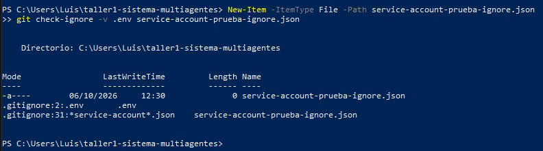
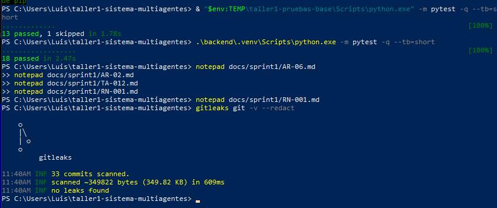
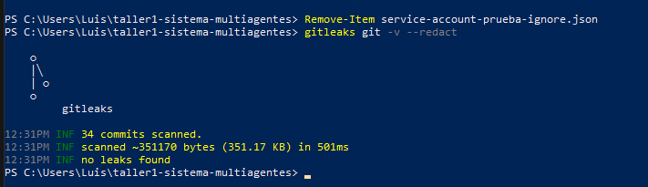
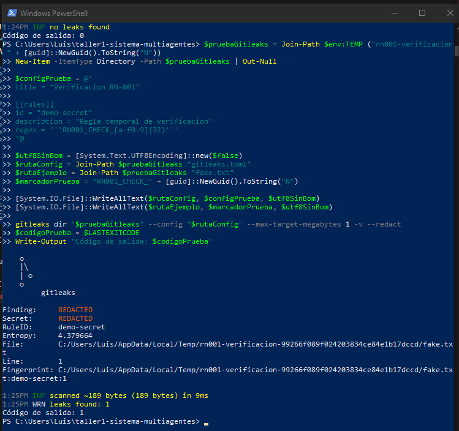
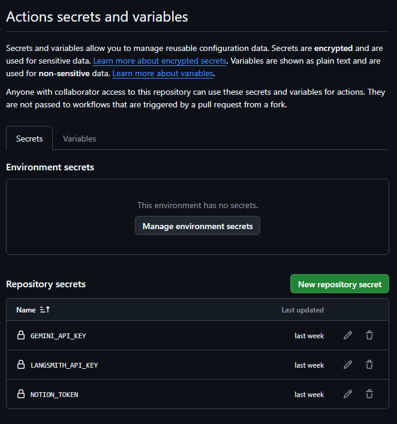

# RN-001 · Seguridad de secretos

## 1. Registro los datos del PBI

Reviso los datos definidos para **RN-001 · Seguridad de secretos**.
Esta actividad busca evitar que las credenciales y los archivos
sensibles queden expuestos en el repositorio.

| Campo | Información |
|---|---|
| PBI | RN-001 · Seguridad de secretos |
| Story Points estimados | 0.5 SP |
| Horas estimadas | 2 horas |
| Horas reales registradas | 15 min |
| Responsable | Reyes |
| Verificador | Mondragón |

## 2. Reviso la protección de archivos sensibles

Reviso `.gitignore` y compruebo que `.env` y los archivos de
credenciales de cuentas de servicio estén excluidos.

Para verificar las reglas, creo un archivo vacío de prueba y ejecuto:

```powershell
New-Item -ItemType File -Path service-account-prueba-ignore.json
git check-ignore -v .env service-account-prueba-ignore.json
```

Compruebo que la salida identifica la regla que protege cada archivo.
Después elimino únicamente el archivo vacío de prueba:

```powershell
Remove-Item service-account-prueba-ignore.json
```



## 3. Verifico el archivo `.env.example`

Reviso `.env.example` como plantilla de configuración del proyecto.
Este archivo documenta las variables necesarias sin incluir sus
credenciales reales.

Compruebo los seis nombres requeridos para RN-001:

```dotenv
GITHUB_TOKEN=
NOTION_TOKEN=
GOOGLE_SERVICE_ACCOUNT_JSON=
GEMINI_API_KEY=
LANGSMITH_API_KEY=
DATABASE_URL=
```

Mantengo las credenciales reales en la configuración local o en los
secretos del repositorio.

## 4. Verifico la instalación de Gitleaks

Compruebo la versión instalada:

```powershell
gitleaks version
```

Resultado observado: **8.30.1**.

## 5. Documento el falso positivo histórico

Reviso el hallazgo identificado con la regla `generic-api-key`
en la línea 28 de `.env.example`, correspondiente al commit:

```text
e9de2dd70bbd6c759fe797a381c959b2c74daad4
```

Compruebo que `LANGSMITH_API_KEY` estaba vacía en esa versión:
su valor tenía longitud 0. Por ello, corrijo la descripción anterior,
que lo presentaba como un valor ficticio de ejemplo.

Conservo en `.gitleaksignore` la excepción específica identificada
por commit, archivo, regla y línea:

```text
# Falso positivo histórico: LANGSMITH_API_KEY estaba vacía (longitud 0).
e9de2dd70bbd6c759fe797a381c959b2c74daad4:.env.example:generic-api-key:28
```

La excepción no excluye el archivo completo.



## 6. Escaneo el historial del repositorio

Desde la raíz del repositorio ejecuto:

```powershell
gitleaks git -v --redact
```

Registro el resultado de la verificación del 06/10/2026:

| Dato | Resultado |
|---|---|
| Versión de Gitleaks | 8.30.1 |
| Commits escaneados | 34 |
| Información analizada | 351.17 KB |
| Hallazgos reportados | 0 |
| Resultado | `no leaks found` |
| Excepción aplicada | Fingerprint histórico documentado en `.gitleaksignore` |

El escaneo termina sin hallazgos reportados, con la excepción
histórica documentada.



## 7. Realizo una prueba positiva de Gitleaks

En mi primer intento utilizo un token ficticio que no produce una
detección. No considero ese resultado como una prueba positiva
satisfactoria.

Después preparo una carpeta temporal fuera del repositorio,
una regla personalizada llamada `demo-secret` y un archivo
`fake.txt` con un marcador ficticio.

Al ejecutar la prueba aparece este error:

```text
unable to load gitleaks config
toml: invalid character at start of key: ï
```

El código de salida 1 de este intento corresponde al error de
configuración; no demuestra una detección.

Para corregirlo, reescribo la configuración y el archivo de prueba
en UTF-8 sin BOM. Luego repito el comando:

```powershell
gitleaks dir "$pruebaGitleaks" --config "$pruebaGitleaks\gitleaks.toml" -v --redact
```

Considero la prueba satisfactoria únicamente cuando la salida
identifica la regla `demo-secret`, el archivo `fake.txt` y un hallazgo.

**Resultado observado:** Gitleaks detectó un hallazgo con la regla
`demo-secret` en la línea 1 de `fake.txt`. La ejecución terminó
con código de salida 1, sin errores de configuración.




La prueba personalizada comprueba la aplicación de esa regla.
El historial del proyecto se verifica por separado con su
configuración habitual.

## 8. Verifico los secretos de GitHub Actions

Compruebo en **Settings → Secrets and variables → Actions**
que estén registrados los siguientes Repository secrets:

- `GEMINI_API_KEY`
- `LANGSMITH_API_KEY`
- `NOTION_TOKEN`

Registro una captura de sus nombres, sin mostrar sus valores.
No incluyo las credenciales en el código, en `.env.example`
ni en las evidencias.



## 9. Compruebo los criterios de aceptación

| N.° | Criterio | Estado registrado | Evidencia |
|---|---|---|---|
| 1 | Gitleaks reporta 0 hallazgos en el historial, con la excepción documentada. | Cumple | `RN-001_gitleaks_repo.png` y `.gitleaksignore` |
| 2 | `.env` está excluido y `.env.example` contiene los seis nombres requeridos. | Cumple según la verificación documentada | `RN-001_check_ignore.png` y revisión de `.env.example` |
| 3 | Los secretos requeridos están cargados como Repository secrets. | Cumple según la verificación documentada | `RN-001_actions_secrets.png` |

Completé la prueba positiva fuera del repositorio mediante una
regla temporal. Gitleaks detectó el marcador ficticio de `fake.txt`.

## 10. Registro el estado de la entrega

Documento las reglas de exclusión, las variables de configuración,
los secretos de GitHub Actions y el escaneo del historial.

La última verificación del proyecto obtuvo:

- Gitleaks: `no leaks found` en 34 commits.
- Pruebas del proyecto: `18 passed`.
- `git diff --check`: sin errores reportados.

Completé la prueba positiva fuera del repositorio mediante una
regla temporal. Gitleaks detectó el marcador ficticio de `fake.txt`.

## 11. Tiempo dedicado

- Horas planificadas: 2 h.
- Tiempo real registrado hasta ahora: 15 min.
- Motivo de la diferencia: utilicé la IA como apoyo durante el desarrollo.

Actualizo el tiempo total con las correcciones y verificaciones
adicionales, manteniendo la misma cifra en este documento,
en la tabla inicial y en mi registro de Notion.
## 12. Reglas explícitas de seguridad y regresión automática

Actualización de publicación del 06/10/2026. Se conservan las evidencias y resultados registrados anteriormente por el equipo; no se presentan como un nuevo escaneo de esta publicación.

| Regla | Aplicación |
|---|---|
| No versionar credenciales | Excluir `.env`, `.env.*`, archivos de cuentas de servicio, `client_secret_*.json`, `credentials.json`, `token.json`, claves `.pem` y `.key`. |
| Mantener una plantilla pública | La excepción `!.env.example` permite versionar los nombres de variables con valores sensibles vacíos. |
| Proteger las evidencias | No incluir tokens, contraseñas, cabeceras Authorization ni contenido de credenciales en capturas o logs. |
| Limitar permisos | Usar credenciales de lectura para integraciones de lectura. El workflow TA-035 usa `contents: read` y no necesita Repository secrets para sus pruebas simuladas. |
| Revisar antes de publicar | `.gitignore` no protege archivos ya versionados ni detecta secretos incrustados. Revisar el diff y escanear archivos e historial con salida redactada. |
| Atender exposiciones | Revocar o rotar el secreto, actualizar consumidores y coordinar la limpieza del historial. Borrar el último archivo no invalida una credencial filtrada. |

Verificación automática desde la raíz:

```bash
python -m pytest -q tests/test_seguridad_secretos.py
```

Comprueba exclusiones, la excepción de `.env.example` y las seis variables sensibles requeridas sin valores. TA-035 ejecuta estas pruebas junto con la regresión del proyecto. Estas comprobaciones no sustituyen Gitleaks ni vuelven a verificar los secretos configurados en GitHub.

CP-08 del plan TA-003 verifica roles y aislamiento, no seguridad de secretos. Su asociación anterior a RN-001 queda corregida en el documento del plan; el PBI de roles está por confirmar.
