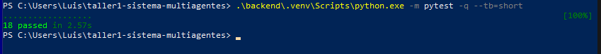
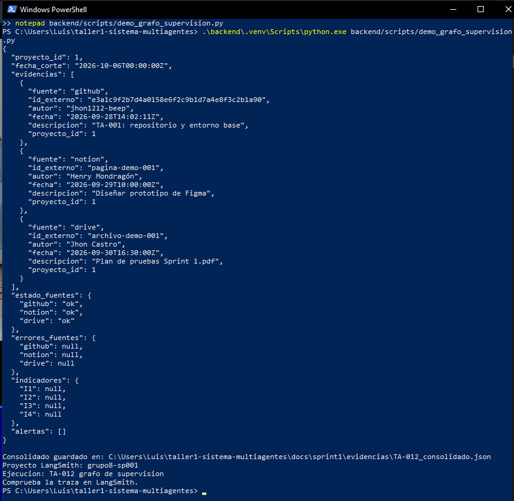
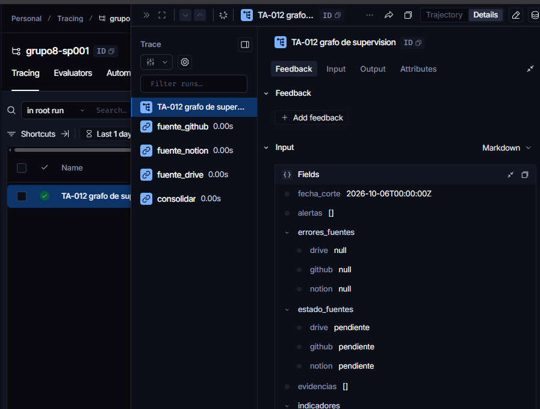

# TA-012 · Grafo de supervisión con la fuente falsa

## Objetivo

Implementé el grafo de supervisión utilizando el contrato
FuenteEvidencia y el adaptador FuenteEvidenciaFalsa de AR-01.
El grafo reúne evidencias de GitHub, Notion y Drive para un proyecto.

## Implementación

Creé backend/app/modulos/supervision/grafo/construir_grafo.py.

Definí cuatro nodos que se ejecutan en este orden:

1. fuente_github
2. fuente_notion
3. fuente_drive
4. consolidar

Cada nodo consulta la fuente mediante su puerto y filtra las evidencias
por fuente y proyecto. Este filtro es necesario porque el adaptador
falso devuelve los ejemplos de las tres fuentes en cada consulta.

Registré el estado y los errores de cada fuente. Si una consulta falla,
el grafo registra el fallo y continúa con las demás fuentes.

En consolidar eliminé duplicados utilizando la combinación
fuente e id_externo.

## Pruebas

Creé tests/test_grafo_supervision.py con cinco pruebas:

- Consolidación de las tres fuentes sin duplicados.
- Consulta de las referencias con el proyecto correcto.
- Separación de evidencias por proyecto.
- Continuidad cuando una fuente falla.
- Rechazo de referencias incompletas.

Ejecuté las pruebas específicas:

    .\backend\.venv\Scripts\python.exe -m pytest tests/test_grafo_supervision.py -q --tb=short

Resultado observado: 5 passed.

Después ejecuté todas las pruebas:

    .\backend\.venv\Scripts\python.exe -m pytest -q --tb=short

Resultado observado: 18 passed.

## Demostración

Creé backend/scripts/demo_grafo_supervision.py y lo ejecuté con:

    .\backend\.venv\Scripts\python.exe backend/scripts/demo_grafo_supervision.py

La demo utiliza el proyecto 1 y la fecha de corte
2026-10-06T00:00:00Z.

Comprobé que el consolidado contiene tres evidencias:
una de GitHub, una de Notion y una de Drive.
Las tres fuentes terminaron en ok y sus errores quedaron en null.

Guardé el resultado en:

    docs/sprint1/evidencias/TA-012_consolidado.json

## Traza en LangSmith

Configuré mi .env local con LANGSMITH_TRACING=true,
LANGSMITH_PROJECT=grupo8-sp001 y mi clave privada.

Comprobé la ejecución "TA-012 grafo de supervision" en LangSmith
y verifiqué los nodos fuente_github, fuente_notion, fuente_drive
y consolidar.

La clave permanece en el .env local.

## Evidencias

[Consultar el consolidado](evidencias/TA-012_consolidado.json)

## Alcance y limitaciones

Esta implementación utiliza datos ficticios y no consulta las APIs
reales de GitHub, Notion o Drive.

La fuente falsa actual no aplica filtros por referencia ni por fecha.
La fecha de corte queda registrada en el estado.

Los indicadores permanecen sin calcular y las alertas vacías.
Su cálculo corresponde a tareas posteriores.

## Entrega

Preparé la implementación en la rama reyes/semana6.
La revisión y la integración en main se registran en el Pull Request.